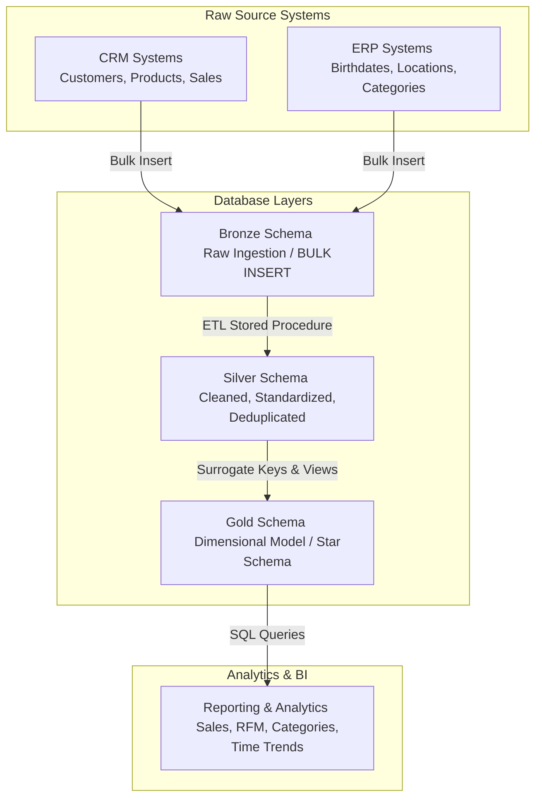
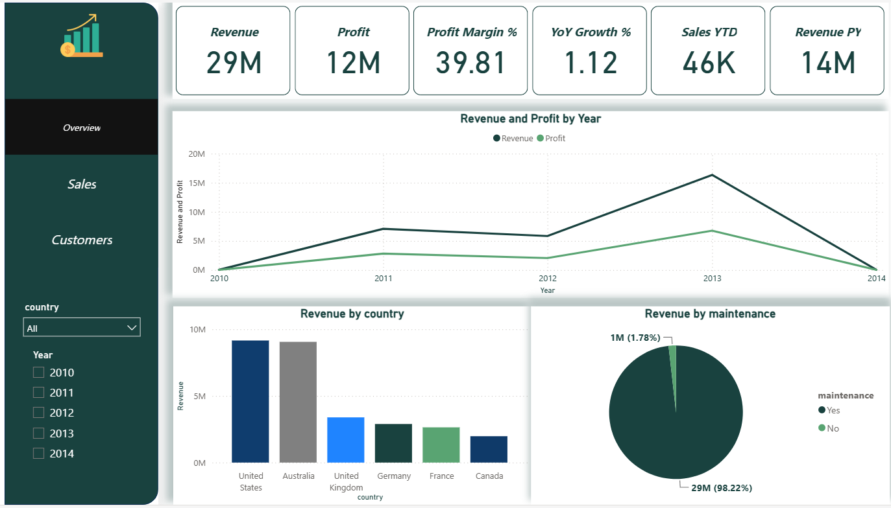
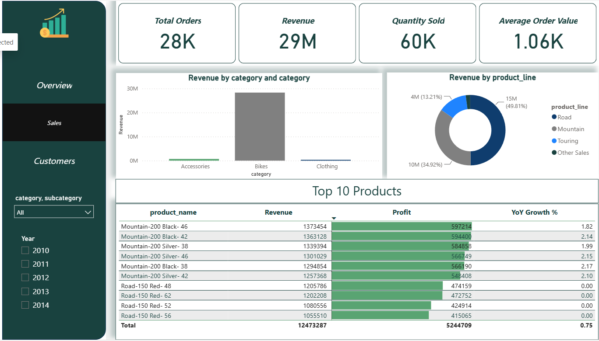
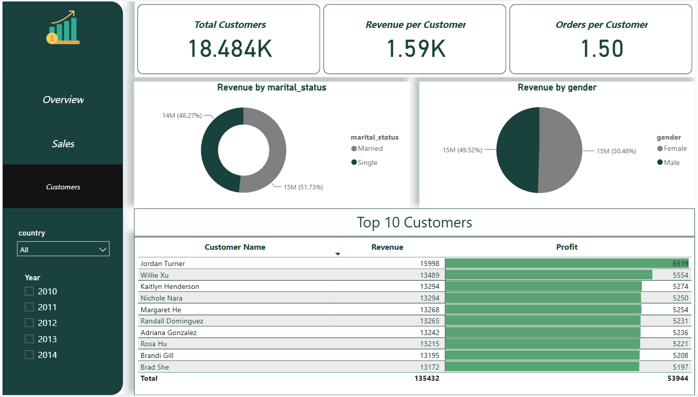

# End-to-End SQL Data Warehouse & Analytics Project

This repository contains an end-to-end data warehousing and business intelligence solution built using **Microsoft SQL Server (T-SQL)**. The project implements a **Medallion (Bronze → Silver → Gold) Architecture** to ingest raw customer and transactional data from disparate source systems (CRM and ERP), clean and transform it, model it into an analytical Star Schema, and perform advanced business analytics.

---

## 🏗️ Architecture & Data Flow

The project processes data sequentially through three layers:



1.  **Bronze (Raw Ingestion):** Imports raw CSV data directly into tables with minimal schema constraints using SQL Server `BULK INSERT`.
2.  **Silver (Clean & Standardize):** Standardizes values (e.g., text formatting, handling dates, unifying gender codes), resolves quality issues (missing values, typos), and performs data deduplication.
3.  **Gold (Dimensional Model):** Builds standard **Star Schema** structures using views (`dim_customers`, `dim_products`, and `fact_sales`) to provide business-ready dimensional data with surrogate keys.
4.  **Analytics Layer:** Executes complex T-SQL queries over the gold layer to generate reports on sales performance, customer demographic segmentations, and Recency-Frequency-Monetary (RFM) cohorts.

---

## 📂 Project Structure

```text
├── datasets/                             # Raw CSV Source Data
│   ├── source_crm/                       # CRM Exports (Customers, Products, Sales details)
│   └── source_erp/                       # ERP Exports (Customer details, Country maps, Category codes)
├── Data Warehouse/                       # SQL Scripts for DDL and ETL Logic
│   ├── init_database.sql                 # Database setup and schema definitions
│   ├── bronze/                           # Raw Store Setup
│   │   ├── ddl_bronze.sql                # Bronze table schema creations
│   │   ├── load_bronze.sql               # SP to ingest CSVs into Bronze tables
│   │   └── check_quality_bronze.sql      # Profiling and record count validations
│   ├── silver/                           # Data Cleansing Layer
│   │   ├── ddl_silver.sql                # Silver table schema creations
│   │   ├── load_silver.sql               # SP executing cleansing and ETL transformations
│   │   └── check_quality_silver.sql      # Checks for duplicates, nulls, and domain values
│   └── gold/                             # Dimensional Model (Views)
│       ├── ddl_gold.sql                  # Views for dim_customers, dim_products, fact_sales
│       └── chaeck_quality_gold.sql       # Validations for PK uniqueness and referential integrity
└── Analysis/                             # Analytical Reports
    ├── 00_EDA.sql                        # Exploratory Data Analysis & Integrity checks
    ├── 01_Sales_Report.sql               # Sales, quantities, and order values
    ├── 02_Customers_Report.sql           # Customer demographical distributions
    ├── 03_Products_Report.sql            # Product performance metrics
    ├── 04_Categories_Report.sql          # Product categorization and subcategory trends
    ├── 05_Customer_RFM_Report.sql        # Advanced Recency, Frequency, & Monetary Segmentation
    └── 06_Time_Analysis.sql              # Seasonality and monthly growth analysis
```

---

## 🚀 Getting Started

### Prerequisites
*   **Database Engine:** Microsoft SQL Server (2019 or later recommended)
*   **IDE:** SQL Server Management Studio (SSMS) or Azure Data Studio

### Installation & Deployment Steps

1.  **Clone the Repository**
    ```bash
    git clone https://github.com/your-username/End-to-End-Data-Warehouse-Analytics-Project.git
    cd End-to-End-Data-Warehouse-Analytics-Project
    ```

2.  **Initialize the Database**
    Open SQL Server Management Studio (SSMS), connect to your SQL Server instance, and run:
    *   [init_database.sql](file:///E:/projects%202026/Data%20Analysis%20Projects/project_1/Data%20Warehouse/init_database.sql)
    *(This creates the `DataWarehouse` database and sets up the `bronze`, `silver`, and `gold` schemas)*.

3.  **Run Bronze Layer ETL**
    *   Execute the script [ddl_bronze.sql](file:///E:/projects%202026/Data%20Analysis%20Projects/project_1/Data%20Warehouse/bronze/ddl_bronze.sql) to build the raw tables.
    *   Open and run [load_bronze.sql](file:///E:/projects%202026/Data%20Analysis%20Projects/project_1/Data%20Warehouse/bronze/load_bronze.sql) to compile the loading procedure.
    *   *Note: Update the local CSV file paths in `load_bronze.sql` to point to the correct path on your machine before running.*
    *   Execute the procedure:
        ```sql
        EXEC bronze.load_bronze;
        ```

4.  **Run Silver Layer ETL**
    *   Execute the script [ddl_silver.sql](file:///E:/projects%202026/Data%20Analysis%20Projects/project_1/Data%20Warehouse/silver/ddl_silver.sql) to build the staging tables.
    *   Compile the procedure in [load_silver.sql](file:///E:/projects%202026/Data%20Analysis%20Projects/project_1/Data%20Warehouse/silver/load_silver.sql).
    *   Execute the transformation:
        ```sql
        EXEC silver.load_silver;
        ```

5.  **Expose the Gold Model Views**
    *   Execute [ddl_gold.sql](file:///E:/projects%202026/Data%20Analysis%20Projects/project_1/Data%20Warehouse/gold/ddl_gold.sql) to expose the final dimensions and fact table views.

---

## 📊 Analytics Highlights

Below are a few of the reporting templates located under the `Analysis/` folder:

### 🏆 Customer RFM Segmentation
The script [05_Customer_RFM_Report.sql](file:///E:/projects%202026/Data%20Analysis%20Projects/project_1/Analysis/05_Customer_RFM_Report.sql) segments customers into actionable behavioral segments by assigning scores (1-4) for:
*   **Recency:** How recently did the customer purchase?
*   **Frequency:** How often do they buy?
*   **Monetary Value:** How much revenue do they generate?

This allows classification of customers into groups like *Champions*, *Loyal Customers*, *At Risk*, and *Lost*.

### 📈 Sales Performance & Seasonality
The script [06_Time_Analysis.sql] executes time-series queries measuring monthly revenue growth, year-over-year variations, and rolling moving averages to pinpoint trends.

---

## 📊 Power BI Dashboard & Visualizations

An interactive **Power BI Dashboard** [Sales Dashboard.pbix] directory to visualize the gold schema dataset. The dashboard is structured into three primary reporting pages:

### 1. Overview Dashboard
Provides a high-level summary of the company's financial performance and macro-trends across geographic regions.



*   **Key Performance Indicators (KPIs):**
    *   **Revenue:** $29M
    *   **Profit:** $12M
    *   **Profit Margin %:** 39.81%
    *   **YoY Growth %:** 1.12%
    *   **Sales YTD:** 46K
    *   **Revenue PY (Previous Year):** $14M
*   **Visualizations:**
    *   **Revenue and Profit by Year (Line Chart):** Tracks the trajectory of financial performance over time (2010–2014), highlighting a clear peak in 2013.
    *   **Revenue by Country (Bar Chart):** Breaks down income by country, showing the United States and Australia as the leading markets, followed by the UK, Germany, France, and Canada.
    *   **Revenue by Maintenance (Pie Chart):** Segregates operational revenue from maintenance-related contracts, showing that non-maintenance transactions account for 98.22% ($29M) of the total.

---

### 2. Sales Dashboard
Delivers a deep dive into product performance, categories, and inventory movement.



*   **Key Performance Indicators (KPIs):**
    *   **Total Orders:** 28K
    *   **Revenue:** $29M
    *   **Quantity Sold:** 60K
    *   **Average Order Value:** $1.06K
*   **Visualizations:**
    *   **Revenue by Category (Bar Chart):** Segments business lines into Accessories, Bikes, and Clothing. **Bikes** heavily dominate the revenue generation.
    *   **Revenue by Product Line (Donut Chart):** Shows the distribution within product lines—Road (49.81%), Mountain (34.92%), Touring (13.21%), and Other Sales.
    *   **Top 10 Products (Data Table with Progress Bars):** Highlights the top 10 highest-grossing products, predominantly featuring the *Mountain-200* and *Road-150* series, detailed with individual Revenue, Profit, and YoY Growth rates.

---

### 3. Customers Dashboard
Focuses on user demographics and behavioral insights to understand who the target buyers are.



*   **Key Performance Indicators (KPIs):**
    *   **Total Customers:** 18.484K
    *   **Revenue per Customer:** $1.59K
    *   **Orders per Customer:** 1.50
*   **Visualizations:**
    *   **Revenue by Marital Status (Donut Chart):** Compares buying power based on social demographics, showing a nearly balanced split between Single customers (51.73%) and Married customers (48.27%).
    *   **Revenue by Gender (Pie Chart):** Segments revenue by biological gender, showing an almost equal contribution from Female (50.48%) and Male (49.52%) segments.
    *   **Top 10 Customers (Data Table with Progress Bars):** Features a leaderboard of individual high-value VIP clients ranked by their total Revenue and Profit contributions (e.g., Jordan Turner, Willie Xu, etc.).

---

### 🎛️ Global Slicers & Interactivity
Every dashboard page includes a uniform, left-hand navigation and filtering pane containing:
*   **Country Filter Dropdown:** Allows dynamic cross-filtering for specific regional isolation.
*   **Year Checkboxes (2010–2014):** Enables multi-select or single-select historical drilling for time-series analysis.

---

## 🛠️ Built With
*   **T-SQL (Transact-SQL):** Scripting language used for DDL, SP, and analytics views.
*   **Microsoft SQL Server Engine:** Central Relational Database Management System.
*   **Power BI Desktop:** Business intelligence dashboard and data visualization.
*   **Mermaid.js:** Visualization architecture workflow.

